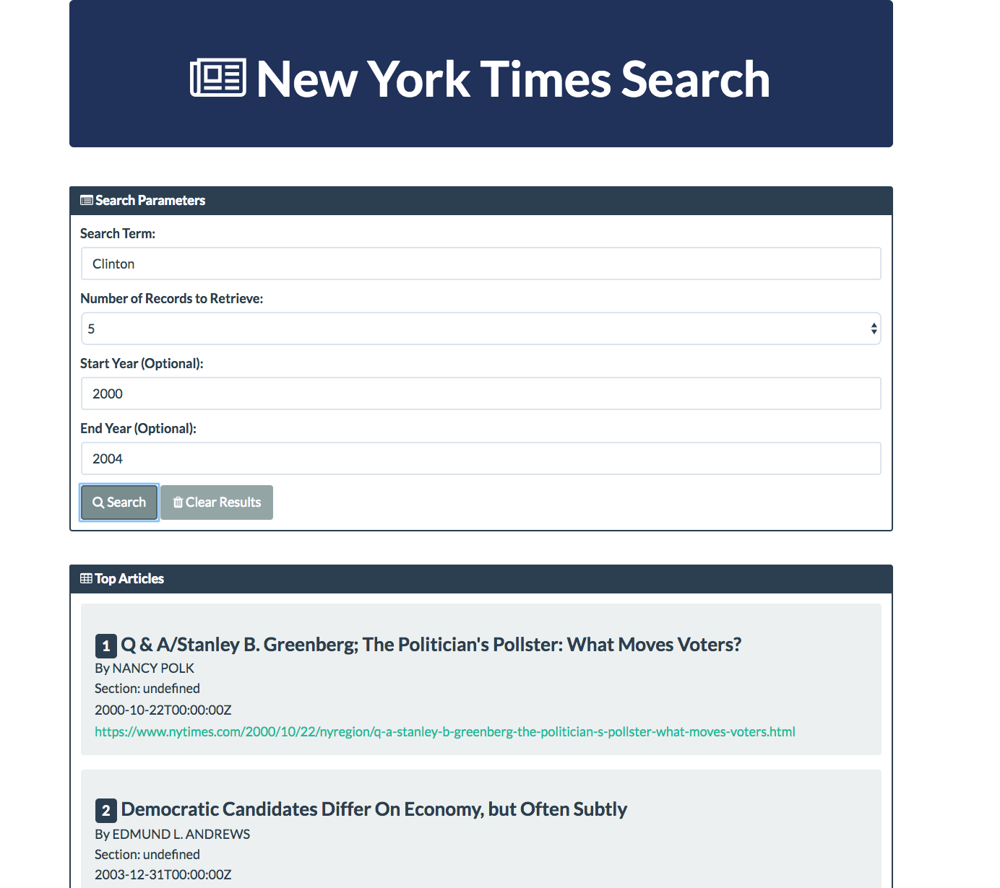

# NYT-Search

### Instructions:

#### UI Team

* Create the layout for the design above. Feel free to use Bootstrap or to do something more customized of your own.

* Make sure to organize your code so as to have the necessary IDs.

* Incorporate text boxes for capturing User Input. Then research how to retrieve the input values in JavaScript

* Begin creating basic click events. Register the submit button

* Get the data from the text-boxes and store as variables.

* Experiment with creating content regions for where the article will go.

* Continue polishing the display of content in the HTML.

* Consider adding styling or other jQuery tricks.

* Consider using Bootswatch and/or Font Awesome to add more visual appeal

#### Data Team

* Do preliminary research on the API.

* NYT-API

Register for an API Key if you have not already done so.

Understand what format the URL should look like to make an Article Call. (Hint: Use the API Console!!)

Experiment with console logging various fields.

* Create the AJAX call needed to retrieve data then console.log all of the relevant fields.

* Incorporate various “optional parameters” (hard code these in initially).

* Take note of various “bugs” that appear with certain searches.

* Put in a hard-effort to deal with bugs. How can you handle missing fields?

